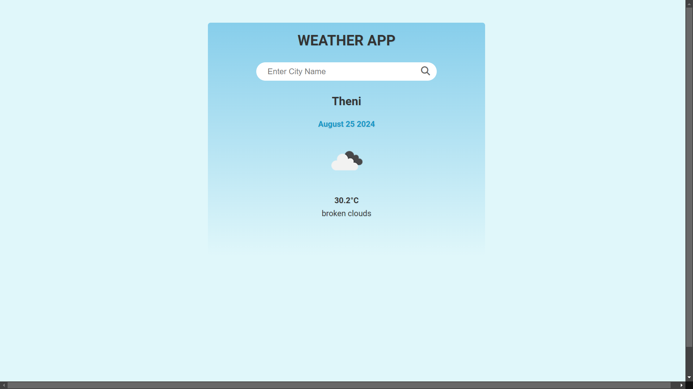

# Weather App

A simple weather application that allows users to get the current weather conditions for any city. The app uses the OpenWeatherMap API to fetch weather data and displays it dynamically using JavaScript.

## Screenshots



## Features

- **Search by City**: Users can enter the name of a city to get the current weather information.
- **Real-time Weather Data**: The app fetches real-time weather data, including temperature, weather description, and an icon representing the weather condition.
- **Responsive Design**: The app is built using HTML and CSS, ensuring a clean and responsive design.

## Technologies Used

- **HTML**: Structure of the web page.
- **CSS**: Styling of the application.
- **JavaScript**: Logic to fetch and display weather data.
- **Date-fns**: A lightweight date utility library to format the date.
- **OpenWeatherMap API**: Fetching real-time weather data.

## How to Use

1. **Clone the repository:**

   ```bash
   git clone https://github.com/your-username/weather-app.git
